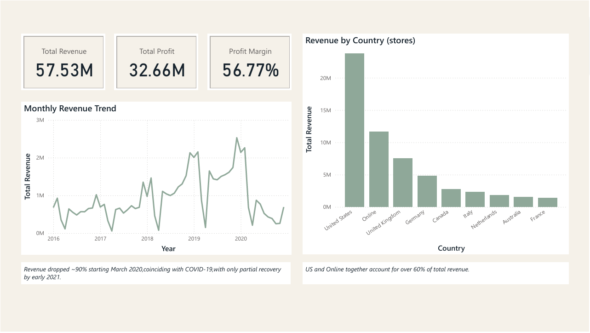

# Sales & Profitability Analysis — Global Electronics Retailer
**End-to-end BA project revealing which products, channels, and customer segments actually drive this retailer's revenue — including a ~90% COVID-era collapse and a customer base skewing heavily toward age 46+.**  
Excel · MySQL · Power BI   

## Overview

This project analyzes five years (2016–2021) of transaction data from a global electronics retailer to identify which products, stores, and time periods drive the most profit. Working from a raw, uncleaned dataset, I independently handled the full analytics lifecycle — data cleaning in Excel, relational database design and SQL analysis in MySQL, and an interactive Power BI dashboard — arriving at findings that would directly inform inventory, marketing, and channel investment decisions.
## Key Findings
- **Desktop PCs lead on every measure** — the top product line by both total profit and units sold, making it the clear inventory priority.
- **Online rivals entire countries** — the Online channel alone generates more revenue ($11.6M) than the UK or Germany individually.
- **Consistent, reliable seasonality** — revenue spikes every December without exception across all five years.
- **A sharp, attributable disruption** — revenue collapsed ~90% between Feb–Apr 2020, coinciding precisely with COVID-19 lockdowns, with only partial recovery by early 2021.
- **Revenue skews toward older customers** — customers aged 46+ account for roughly 60-70% of total revenue.
## Tools & Skills
- **Excel** — data auditing, cleaning, formula-driven transformation
- **MySQL** — relational schema design, composite keys, multi-table joins, aggregation
- **Power BI** — data modeling, DAX measures, interactive dashboards
- **Analysis** — KPI definition, currency conversion logic, time-series trend analysis
## The Process
The source data required real cleaning before it could be trusted — inconsistent character encodings across files, currency values stored as formatted text, non-standard date formats, and a multi-currency revenue calculation that had to be validated carefully (an early mix-up between multiplying and dividing by the exchange rate produced a plausible-looking but completely wrong result — a good reminder that a query running without an error isn't the same as a query being correct). 
Every SQL result was independently cross-checked against its Power BI equivalent before being treated as reliable.
## Full Case Study
For the complete write-up — including business recommendations and the full data quality methodology — see [`docs/global-electronics-retailer-analysis-case-study.docx`](docs/global-electronics-retailer-analysis-case-study.docx).
